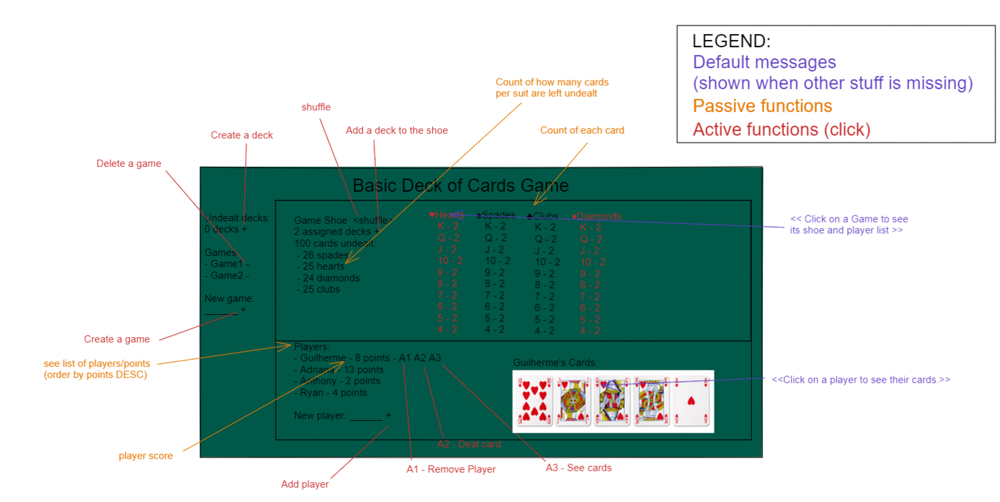

# A Basic Deck of Cards Game

This is a set of classes in React + Java and a REST API that represent a deck of poker-style playing cards along with the services for a very basic game between multiple players holding cards. 

A deck is defined as follows: Fifty-two playing cards in four suits: hearts, spades, clubs, and diamonds, with face values of Ace, 2-10, Jack, Queen, and King.

The game API is a very basic game in which one or more decks are added to create a ‘game deck’, commonly referred to as a shoe, along with a group of players getting cards from the game deck.

# The following operations are available:

● Create and delete a game

● Create a deck

● Add a deck to a game deck (once a deck has been added to a game deck it cannot be removed)

● Add and remove players from a game

● Deal cards to a player in a game from the game deck (Specifically, for a game deck containing only one deck of cards, a call to shuffle followed by 52 calls to dealCards(1) for the same player should result in the caller being provided all 52 cards of the deck in a random order. If the caller then makes a 53rd call to dealCard(1), no card is dealt. This approach is to be followed if the game deck contains more than one deck.)

● Get the list of cards for a player

● Get the list of players in a game along with the total added value of all the cards each player holds; use face values of cards only. Then sort the list in descending order, from the player with the highest value hand to the player with the lowest value hand:

○ For instance if player ‘A’ holds a 10 + King then her total value is 23 and player ‘B’ holds a 7 + Queen then his total value is 19, so player ‘A’ will be listed first followed by player ‘B’.

● Get the count of how many cards per suit are left undealt in the game deck (example: 5 hearts, 3 spades, etc.)

● Get the count of each card (suit and value) remaining in the game deck sorted by suit (hearts, spades, clubs, and diamonds) and face value from high value to low value (King, Queen, Jack, 10….2, Ace with value of 1)

● Shuffle the game deck (shoe)

○ Shuffle returns no value, but results in the cards in the game deck being randomly permuted. Please do not use library-provided “shuffle” operations to implement this function. You may use library- provided random number generators in your solution.

○ Shuffle can be called at any time

# Create React App

This project was bootstrapped with [Create React App](https://github.com/facebook/create-react-app).

## Available Scripts

In the project directory, you can run:

### `npm start`

Runs the app in the development mode.\
Open [http://localhost:3000](http://localhost:3000) to view it in the browser.

The page will reload if you make edits.\
You will also see any lint errors in the console.

### `npm test`

Launches the test runner in the interactive watch mode.\
See the section about [running tests](https://facebook.github.io/create-react-app/docs/running-tests) for more information.

### `npm run build`

Builds the app for production to the `build` folder.\
It correctly bundles React in production mode and optimizes the build for the best performance.

The build is minified and the filenames include the hashes.\
Your app is ready to be deployed!

See the section about [deployment](https://facebook.github.io/create-react-app/docs/deployment) for more information.

### `npm run eject`

**Note: this is a one-way operation. Once you `eject`, you can’t go back!**

If you aren’t satisfied with the build tool and configuration choices, you can `eject` at any time. This command will remove the single build dependency from your project.

Instead, it will copy all the configuration files and the transitive dependencies (webpack, Babel, ESLint, etc) right into your project so you have full control over them. All of the commands except `eject` will still work, but they will point to the copied scripts so you can tweak them. At this point you’re on your own.

You don’t have to ever use `eject`. The curated feature set is suitable for small and middle deployments, and you shouldn’t feel obligated to use this feature. However we understand that this tool wouldn’t be useful if you couldn’t customize it when you are ready for it.
